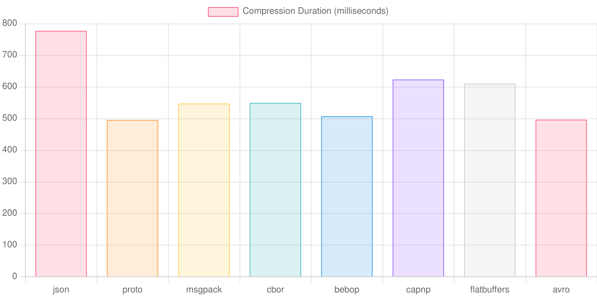
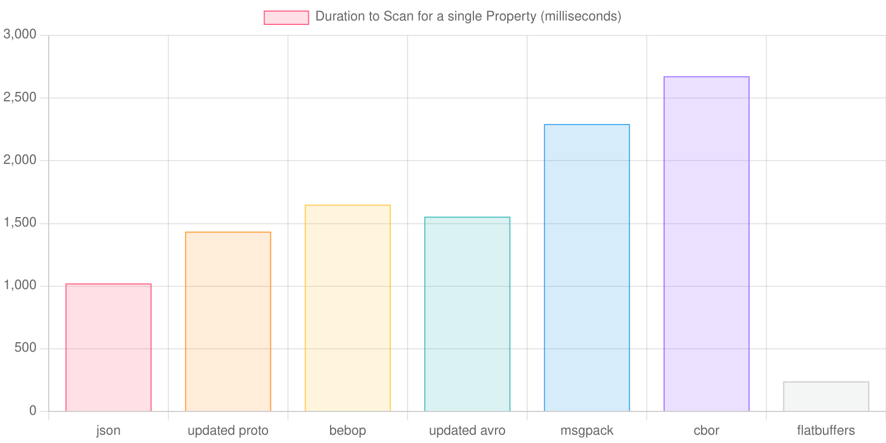

# Binary Encodings in the Browser in 2025

## TL;DR

There are a number of binary encoding libraries that perform better than JSON deserialization in a browser. This is not as obvious as it might initially seem; it is very easy to get this subtly wrong. 

A couple of libraries ([avsc](https://github.com/mtth/avsc) and [protobuf.js](https://github.com/protobufjs/protobuf.js/)) did not outperform JSON initially, but after I made some tweaks, they performed significantly better than JSON.

In this post, I discuss the downsides of using JSON versus a binary encoding, the performance characteristics of several popular binary encoding libararies in JavaScript, and other benchmarks I found online that give misleading results.

## Benchmark Results:

Here were my overall results:

These results are pretty nuanced, so you should still read the rest of this post :)

## Strengths of JSON

JSON has a number of strengths:

* It is directly supported by the JavaScript runtime, no libraries are required.
* Serialized JSON is somewhat human readable without needing additional tools.
* Until somewhat recently, JSON outperformed binary encodings in browsers.

## Why Wouldn't We Just Use JSON?

JSON also has many weaknesses when compared to alternative formats:

### Required String Input

`JSON.parse` requires a string as input. This can be problematic with large inputs, as [some JavaScript implementations cap the length of a string at 512MB (nodejs) or 1GB (Chrome)](https://developer.mozilla.org/en-US/docs/Web/JavaScript/Reference/Global_Objects/String/length).

Requiring a string as input is also problematic from a performance perspective, since this means that the entire message must be UTF-8 decoded.

### Limited Type Support
JSON does not support many types that are important for many types of programs. For example, JSON does not have a 64 bit integer type. Some implementations will use a 64 bit floating point type for these values, which will silently mangle values greater than or equal to 2 to the 53rd power. The workaround for this is typically to represent these values using strings, which can be parsed into a BigInt value, or just kept in a string representation if numeric operations will not be performed on these values.

As another example, JSON does not have a native "date" type, which means that the programmer will be responsible for manually constructing a `Date` from either a number or a string received in JSON.

This is important to consider when doing these kinds of comparisons, since it is not cheap to parse `BigInt`s and `Date`s, and some libraries can encode these values directly.

### Schemaless

Since JSON is schemaless, decoding a JSON message performs no validation on the shape or type of the decoded data. If we want these sorts of validations, we must validate messages ourselves when we receive them.

Many serialization formats, like Protobuf, perform this sort of validation implicitly when deserializing messages. Since this validation can be expensive, it's important when comparing serialization formats to consider which formats contain these kinds of guardrails "for free". This is something that many existing benchmarks get wrong.

#### Digression: Javascript Object Validation Libraries

When doing this work, I looked at a handful of libraries in JavaScript for validating that an object matches a particular schema.

One such library is called "Zod". Zod was extremely slow, so it felt unfair to rely on it when doing comparisons. I found another library called Ajv, which was pretty darn fast, but could not verify anything outside of JSON's types. For my benchmark, that was good enough. In a real project, I would probably research other alternatives and try to find a library that both performs well and supports a wider range of types.

### Large Serialized Message Size

JSON produces very large messages, which consumes additional network bandwidth. This can be mostly mitigated by compressing these messages with Zstd, however, this costs additional CPU time on the server side that other formats do not need to pay to achieve similar results.

(Note that it's reasonable to implement compression in a streamed manner, meaning that this CPU time could be parallelized with IO time. However, this is still an added cost on the server's CPU that is worth considering.)

### Poor Performance on the Server Side

In my benchmarks, using a Rust server, JSON serialization was slower han most alternatives.

## Benchmarking Subtleties

To benchmark, I did the following for each encoding library:

1. Fetch an encoded message from the server. Include a header from the server describing how much time was needed to process the message on the server side.
2. Deserialize the encoded message
3. Construct a "Plain Old JavaScript Object" from it. This is an obect that resembles a type that I would actually use for programming and internal APIs within a process.
4. Validate that the plain old JavaScript object actually matches the expected type.

From this, I computed two stats:

1. "End to End client side time to unverified message". This is the elapsed time for steps 1-3, minus any time spent on the server.
2. "End to End client side time to verified message". This is the time needed for all 4 steps above, minus the time spent on the server.

### Data Set

I used the [NYC Citibike Dataset](https://citibikenyc.com/system-data) for this experiment, as it gave me a usable, real world data set with enough data points to be interesting.

To make things interesting, I picked a set of trips that resulted in about 340MB of serialized JSON.

### Strings vs Binary Encodings

As mentioned above, `JSON.parse` requires a string as input, while other libraries require binary data. This makes benchmarking more challenging, since decoding binary arrays to strings ends up taking a significant portion of any parsing task. Simply comparing `JSON.parse(string)` against something like `avroType.decode(binary)` gives JSON an unfair advantage. However, when using the `fetch` API, this string decoding may happen implicitly.

We can mitigate this by tracking the end to end performance, including the time to fetch the encoded message from the server. 

### Schema vs Schemaless

As mentioned above, some of the libraries I tested were schemaless, while some implicitly perform schema verification. If schema verification is a requirement for a particular use case, then it's important to add schema verification to the schemaless encodings.

This is why we track both an "unverified" and a "verified" message deserialize time.

### Lazy Decoding and Type Differences

Several libraries, like Flatbuffers and Cap'n Proto, implement some form of "lazy decoding", where the deserialized object does not actually do any deserialization until needed. This can significantly improve performance for scenarios where not all parts of a serialized message actually need to be read. In order to get a fair comparison, I materialized "Plain Old JavaScript objects" from deserialized messages.

This also helps get a fair comparison between libraries that support `Date` types and libraries that do not, since the "Plain Old JavaScript object" construction also constructs `Date` objects when necessary.

### IO Performance

These encodings differ greatly in serialized message size, which will lead to dramatically different results in a real world environment.

I ran these benchmarks locally, without any kind of network throttling, which I expect minimizes the effect of network IO without minimizing the effects of internally copying larger buffers. However, message size should probably be an important factor for any scenario where a client is expected to be bandwidth limited (which I expect is almost any use of a browser).

## Avro with Avsc

By default, as of April of 2025, the released version of [avsc](https://github.com/mtth/avsc) uses a very slow `Buffer` polyfill by default, which causes extremely bad deserialization performance. However, the latest version on the `master` branch supports `Uint8Array` directly, and does not suffer these performance problems:

I also really like Avro's concept of "logical types". `Avsc` let me use logical types to directly decode `Date` objects from an integer number of milliseconds since the epoch.

## Protobuf.js

[Protobuf.js](github.com/protobufjs/protobuf.js) does not perform well by default, as its algorithm for decoding strings is not as efficient as other options. Fortunately, this was easily fixed, and I've submitted [a pull request to the upstream](https://github.com/protobufjs/protobuf.js/pull/2062).

It's also worth noting that I tried alternative Protobuf libraries, including [protobuf-es](https://github.com/bufbuild/protobuf-es/), which did not perform well, and [pbf](https://github.com/mapbox/pbf), which had fantastic performance but did not feature much flexibility or configurability with generated code.

## Bebop

[Bebop](https://github.com/betwixt-labs/bebop) seems really great; the tooling works well, and the performance across different supported languages seems good. It also supports `Date` types out of the box.

The only downside of it is that Bebop seems relatively new and unknown, so I'm not sure it's as safe of a bet as something like Avro or Protobuf.

## Also Ran

I also tested a few others:

### Flatbuffers

[Flatbuffers](https://github.com/google/flatbuffers) had a nice tooling and developer experience story. Flatbuffers in JavaScript uses a lazy approach to deserialization, so Flatbuffers end up being a good choice for scenarios where the entire message will not be deserialized.

Otherwise, when materializing a full blown "fat" JavaScript object, I found Flatbuffer performance to be less than alternatives.

### Capn' Proto

Capn' Proto seems like it's suffered some bitrot, as it was not possible for me to get it to compile on a recent Node.js version. Instead, I opted to test [capnp-es](https://github.com/unjs/capnp-es). This also used a lazy approach to deserialization, but unlike Flatbuffers, performance was still super bad, to the point where I had to drop it from testing to avoid wasting time during my benchmarks. With so many similar alternatives that feature better performance, I'm not sure it makes sense to use Capn' Proto in 2025.

### Msgpack and Cbor

I also tested [msgpackr](https://github.com/kriszyp/msgpackr) and [cbor-x](https://github.com/kriszyp/cbor-x). I've seen great performance with both of these libraries in the past, on the server side, but in the browser, they were some of the slowest libraries that I tested.

## Other Benchmarks Online

In the process of writing this, I came across a number of benchmarks online that I disagree with. I think it's interesting to look at where we differ.

- [JavaScript Serialization Benchmark](https://github.com/Adelost/javascript-serialization-benchmark)
  - This benchmark runs in Node, and uses Node's built in Buffer class instead of the standard `Uint8Array`. Buffer has radically different performance characteristics, so this benchmark shouldn't be used to draw conclusions about browser performance.
  - This benchmark is very heavy on floats and integers and features no strings. I feel like this is not a representative dataset for most use cases.
- [Avsc's Benchmarks](https://github.com/mtth/avsc/wiki/Benchmarks)
  - There are screenshots of a Browser based benchmark available, but the underlying source was unavailable as of this writing.
  - More importantly, these benchmarks reference a version of avsc that is 10 years old, but performance has improved significantly.
- [Protobuf.js's Benchmarks](https://github.com/protobufjs/protobuf.js#performance)
  - This benchmark also uses Node's `Buffer` class, which performs significantly differently than `Uint8Array` when it comes to utf8 decoding.
  - This benchmark seems a bit biased towards types that Protobuf can encode efficiently, like an array of booleans and numbers.
  - I can't totally explain why its result is so different from what I saw before optimizing Protobuf.js

## Conclusion and Next Steps

In conclusion, I think that Bebop, Avro, and Protobuf are all good solutions that can outperform JSON for encoding messages from a server to a browser. However, all of these solutions have significant caveats as of 2025.

Next, I'd like to write a similar post about the server side implementations of these technologies, where I think things are much less nuanced.

