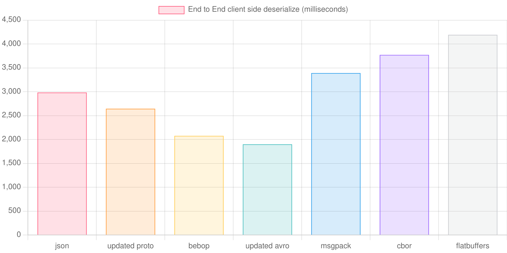
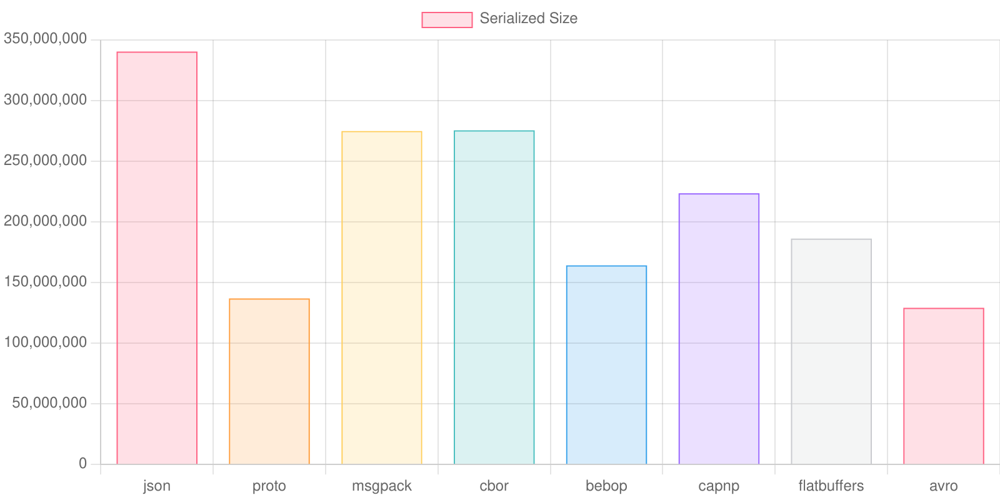
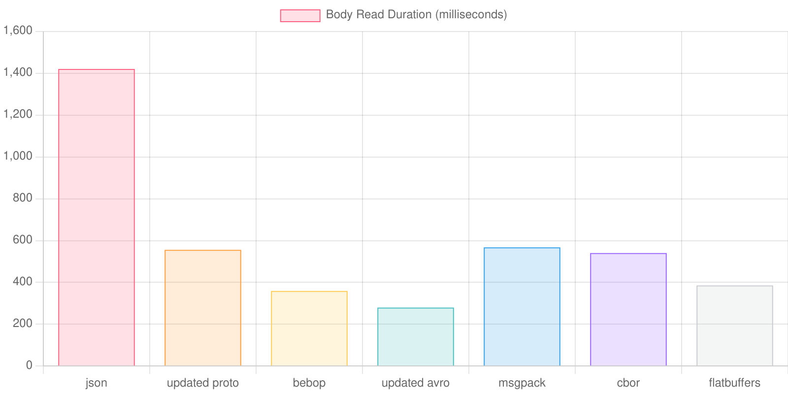
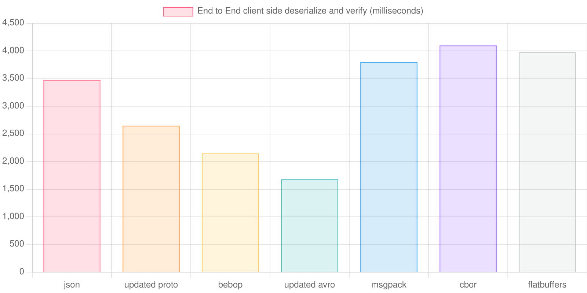
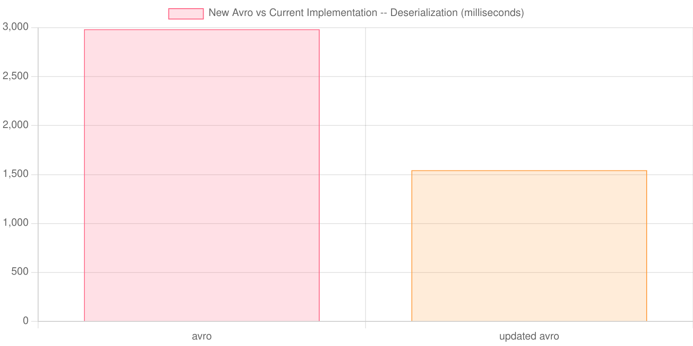
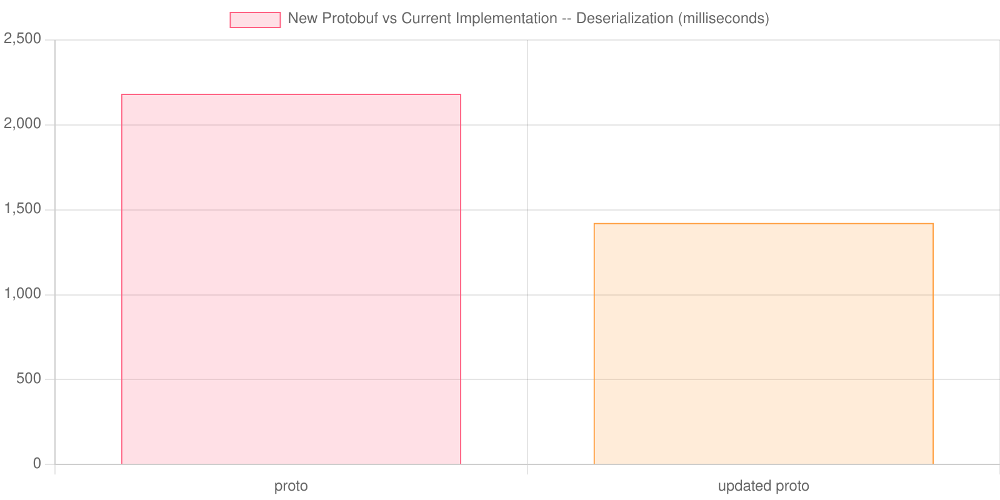
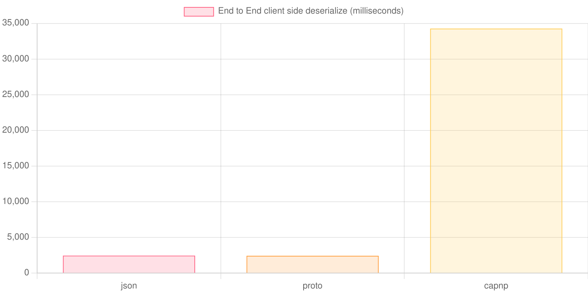

<head>
<title> Binary Formats are Better Than JSON in Browsers! </title>

 

# Binary Formats are Better Than JSON in Browsers!

## TL;DR

- Historically, JSON outperformed alternatives in browsers.
- There are many misleading benchmarks of various libraries online that show misleading results; this mostly comes from running benchmarks in Node.js rather than in the browser.
- Recent(ish) changes to browsers and libraries has disrupted this situation, now several binary formats outperform JSON at deserialization in the browser.
- There are lots of reasons beyond performance to avoid using JSON as the encoding between servers and browsers

## Introduction

Back in 2023, the company I was working for needed an alternative to JSON for large responses from the server to our Web App. We chose to use MessagePack primarily because it was convenient. During this process, I benchmarked a number of different binary encodings. To my surprise, I found that all of them were much slower than JSON in browsers. My conclusion was that MessagePack was a reasonable fit for our needs, but that MessagePack, as well as other reasonable alternatives, came with a large performance cost. We decided this was acceptable, as our bottlenecks were primarily on the server side.

However, I think a number of recent trends have made deserialization performance more important:

1. Internet speeds have gotten much faster in the past few years, as residential gigabit internet is more broadly rolled out, and as 5G is offering increased performance. This eliminates some of the network IO bottleneck. For business software, this effect is greatly amplified, since many large companies will prioritize providing fast internet to their employees.
2. Web apps are becoming more complicated; there's increased desire to use richer and larger datasets in web apps. For many web apps, it may be desirable to send large datasets than to build a smart backend, as this may save development time and simplify the architecture of the application.
3. Users care about responsiveness in web apps. Due to JavaScript's single threaded nature, slow deserialization can block all other interactions with a web app, which will frustrate users.

In the past 3 months, [I've been experimenting with JavaScript binary encoding libraries](https://github.com/adamfaulkner/serialization_bakeoff), and I've found that there are now several options that outperform JSON and otherwise seem really solid.

I'm writing this post to share my experience and my conclusions. 

This graph shows the client side latency for receiving and deserializing a large (340 MB of JSON) message using various different libraries. 

## Challenges of Benchmarking Deserialization in a Browser

It's easy to make mistakes when doing these kinds of benchmarks. Here are some common things I noticed when researching:

### Using Node.js Rather than a Browser for Benchmarking

The most common mistake that I saw when researching this was that most people benchmarking JavaScript use Node.js rather than a browser. There are two major differences between browsers and Node, which have a big impact on this performance:

1. Node.js has a built in class called `Buffer`, which predates when `Uint8Array` was standardized. `Buffer` is still widely used in the Node ecosystem, but since it doesn't exist in the browser, any serialization library that uses it will need to find an alternative. The `Buffer` class performs very differently from `Uint8Array`, as it seems to have faster methods for slicing and converting UTF-8 data to a string.
2. Node can easily incorporate compiled binary code, and libraries like `msgpackr` and `cbor-x` can use these to accelerate their performance.

I suspect that using Node here has caused both `avsc` and `protobuf.js` to overstate their performance historically.

### Finding Representative Datasets

Other benchmarks (for example, this [JavaScript Serialization Benchmark](https://github.com/Adelost/javascript-serialization-benchmark)) tend towards datasets with a high proportion of numeric data, which tend to be easier to optimize with binary encodings. This is great if your use case involves a bunch of floating point numbers, but for most use cases I've seen in my career, strings are more important.

When making decisions using benchmarks, it's important that the data involved be representative of what you're trying to do.

### Accounting for Differences in Input Data Type and Size

In my earlier benchmarks, I compared `JSON.parse(some string)` directly against `binaryEncoding.parse(some buffer)`. This was a mistake for several reasons.

Firstly, decoding a string from a buffer is expensive. In this comparison, JSON gets to skip this expensive step, but in reality, the bytes coming into a browser have to be decoded somewhere.

Secondly, JSON messages are much larger than the binary encoded messages. This means that many parts of the browser that touch the message will need to spend more time processing it, beyond just decoding. For example, the networking code inside the browser would need to spend more time copying memory. By limiting the comparison to just deserialization, we don't capture this cost.

This graph shows how long it took to read the message body from the server, and it's obvious that JSON is actually at a huge disadvantage before deserialization even starts:

I corrected for both of these in my benchmarks by measuring the end-to-end latency from server request to client processing. I then deducted time spent purely on the server side from this end-to-end latency to get the pure client side latency.

#### Aside: Compression

You might think that compression could help us here. Indeed, compression almost totally wipes out the differences between different encodings:

This is very helpful when it comes to addressing network bandwidth concerns, however, the browser still needs to decompress and process more bytes. By measuring the end to end latency for deserializing messages, we capture all of this extra time needed for decompression and processing.

### Schema vs Schema-less

Some of these encodings have a schema; some are schema-less. Encodings that have a schema implicitly perform some validation of the data. If the developer requires validating decoded data, then we need to capture the additional time needed to do this for schema-less encodings.

In my test, this didn't really change things much. But I think it's an important call-out, since schema encodings provide a lot of useful safety for free.

### Lazy Decoding and Type Differences

Several libraries, like Flatbuffers and Cap'n Proto, implement some form of "lazy decoding", where the deserialized object does not actually do any deserialization until needed. This can significantly improve performance for scenarios where not all parts of a serialized message actually need to be read.

It would be problematic if we were to only compare Flatbuffer's "deserialize" method against something like `JSON.parse`, since JSON actually does all of the heavy lifting to allocate real values up front.

Another related problem is that different encodings support different sets of types. For example, Bebop supports `Date`s directly, while something like JSON needs to serialize a number or a string and manually convert it to a date after deserialization.

In order to compare these fairly, I had my benchmark materialize "Plain Old JavaScript objects" from deserialized messages. These objects include `Date` objects and force evaluation of properties from lazy encodings.

The time needed to materialize a "Plain Old JavaScript object" is included in the end-to-end time that we measure.

## Recent(ish) Developments that Make Libraries Faster

As far as I can tell, the browser features needed to support fast binary encodings have been available [since at least early 2020](https://caniuse.com/textencoder), but haven't been widely adopted until more recently. In the past couple of years, there have been a few developments that make binary encodings in the browser much more tenable:

### Bebop 

[Bebop](https://github.com/betwixt-labs/bebop) is an encoding format very similar to protobuf that was developed in [2020](https://github.com/betwixt-labs/bebop/commit/b123649a5bfc4b5d19c31f42676ec6dd546d7ae2). It seems really great; the tooling works well, and the performance across different supported languages seems good. It also supports `Date` types out of the box. [Bebop was originally designed to target browsers with high performance](https://web.archive.org/web/20220826230212/https://rainway.com/blog/2020/12/09/bebop-an-efficient-schema-based-binary-serialization-format/).

The main downside of Bebop is that it seems relatively new and unknown. In fact, the blog post linked above now redirects to "text-os.com", which makes me feel uncomfortable about the future of the company behind this library. I'm not sure Bebop is as safe of a bet as Avro or Protobuf.

### Avro (`avsc` library)

By default, as of April of 2025, the released version of [avsc](https://github.com/mtth/avsc) uses a very slow `Buffer` polyfill in browsers, which causes extremely bad deserialization performance. However, [recently](https://github.com/mtth/avsc/commit/c80c670e81b0f7ba020f72db63f081d41dfd3c49) the latest version on the `master` branch began using `Uint8Array` directly, and does not suffer these performance problems:

With this big improvement in performance, `avsc` becomes the most compelling option for pure performance that I tested.

### Protobuf (`protobuf.js` library)

In my tests, [Protobuf.js](github.com/protobufjs/protobuf.js) did not perform very well at deserialization by default. The main problem was that its algorithm for decoding strings is not as efficient as other options. Fortunately, this was easily fixed, and I've submitted [a pull request to the protobuf.js project](https://github.com/protobufjs/protobuf.js/pull/2062).

I also tried alternative Protobuf libraries, including [protobuf-es](https://github.com/bufbuild/protobuf-es/), which did not perform well, and [pbf](https://github.com/mapbox/pbf), which had fantastic performance but did not feature much flexibility or configurability with generated code.

## Other Libraries

I also tested a few other libraries. I don't think they are a good fit for the browser at this point in time:

### Flatbuffers

[Flatbuffers](https://github.com/google/flatbuffers) had a nice tooling and developer experience story. Flatbuffers in JavaScript uses a lazy approach to deserialization, so Flatbuffers end up being a good choice for scenarios where the entire message will not be deserialized.

Otherwise, when materializing a full blown "fat" JavaScript object, I found Flatbuffer performance to be less than alternatives.

### Cap'n Proto

[Cap'n Proto's recommended JavaScript implementation](https://github.com/capnproto/node-capnp) only targets Node.js, as it is simply a wrapper around a C++ module. It also seems like it's suffered some bitrot, as it was not possible for me to get it to compile on a recent Node.js version. Also, it had plenty of caveats around performance being bad in the documentation.

 Instead, I opted to test [capnp-es](https://github.com/unjs/capnp-es). This library also uses a lazy approach to deserialization. Performance was so bad with Cap'n Proto that I had to drop it from my investigation to be able to iterate more quickly on the other options.

With so many similar alternatives that feature better performance and better browser support, I'm not sure it makes sense to use Cap'n Proto in 2025 for targeting browsers.

### MessagePack and Cbor

I also tested [msgpackr](https://github.com/kriszyp/msgpackr) and [cbor-x](https://github.com/kriszyp/cbor-x). I've seen great performance with both of these libraries in the past, on the server side, but in the browser, they were some of the slowest libraries that I tested.

## Non-Performance Reasons to Avoid JSON

So far this post has been focused on performance, but I think it's also worth mentioning the myriad of downsides to JSON beyond performance:

### Required String Input

`JSON.parse` requires a string as input. This can be problematic with large inputs, as [some JavaScript implementations cap the length of a string at 512MB (Node.js) or 1GB (Chrome)](https://developer.mozilla.org/en-US/docs/Web/JavaScript/Reference/Global_Objects/String/length).

### Limited Type Support & Lack of a Schema
JSON does not support many types that are important for many types of programs. For example, JSON does not have a 64 bit integer type. Some implementations will use a 64 bit floating point type for these values, which will silently mangle values greater than or equal to 2 to the 53rd power. The workaround for this is typically to represent these values using strings, which can be parsed into a BigInt value, or just kept in a string representation if numeric operations will not be performed on these values.

Since JSON is schema-less, decoding a JSON message performs no validation on the shape or type of the decoded data. If we want these sorts of validations, we must validate messages ourselves when we receive them.

Many serialization formats, like Protobuf, perform this sort of validation implicitly when deserializing messages. 

#### A Short Anecdote: Broken Ad Campaigns

At one point in my career, I broke an important client's ad campaign because the company I was at used strings to represent numbers to avoid BigInt issues, and I accidentally added 500 to "500", resulting in a request to fetch the client's 500,500th ad instead of the 1000th ad. This was embarrassing and cost the company some amount of money.

Nowadays, most people use TypeScript, which can avoid some of these kinds of issues. But JSON does nothing to help us here, and indeed actively harms us. We have to actually use a library like [zod](https://zod.dev/) to get good end to end protections here.

### Poor Performance on the Server Side

In my benchmarks, using a Rust server, JSON serialization was slower than most alternatives.

## Conclusions & Future Work

In conclusion, I think that Bebop, Avro, and Protobuf are all good solutions that can outperform JSON for encoding messages from a server to a browser. (Hopefully Avro has a a release soon, and Protobuf.js accepts my PR!)

Next, I'd like to write a similar post about the server side implementations of these technologies, where I think things are a bit less nuanced and simpler.

